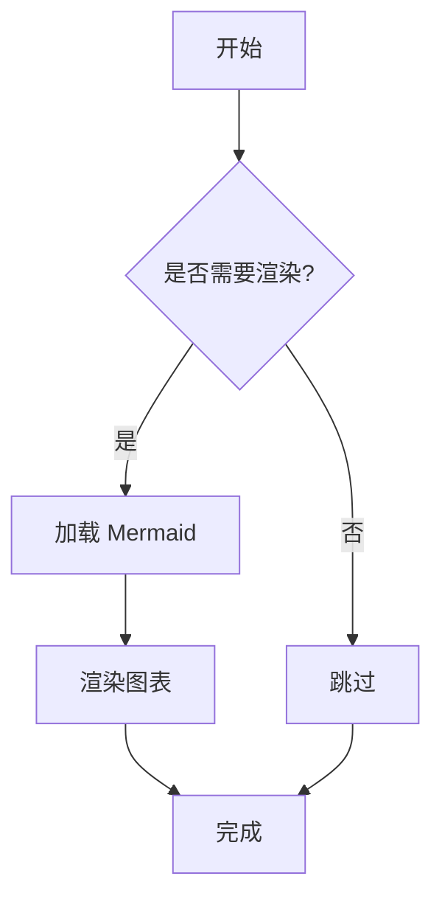

# Mermaid 渲染工具使用指南

## 概述

`mermaidRenderer.ts` 提供了可复用的 Mermaid 图表渲染功能，支持按需加载和多页面使用。

## 功能特性

- ✅ **按需加载**：只有当页面存在 Mermaid 代码块时才加载库
- ✅ **TypeScript 支持**：完整的类型定义
- ✅ **容器选择器**：支持指定渲染范围
- ✅ **全局函数**：暴露渲染函数供动态内容使用
- ✅ **现代 API**：使用 `mermaid.run` 替代已废弃的 `mermaid.init`

## 基本使用

### 1. 简单初始化（推荐）

```javascript
import { initMermaidRenderer } from './utils/mermaidRenderer'

// 初始化 Mermaid 渲染器，自动处理整个页面
initMermaidRenderer()
```

### 2. 指定容器范围

```javascript
import { initMermaidRenderer } from './utils/mermaidRenderer'

// 只渲染特定容器内的 Mermaid 图表
initMermaidRenderer('#content-area')
```

### 3. 手动控制渲染

```javascript
import { renderMermaidDiagrams, hasMermaidBlocks } from './utils/mermaidRenderer'

// 检查是否有 Mermaid 代码块
if (hasMermaidBlocks()) {
    // 手动渲染
    await renderMermaidDiagrams()
}
```

### 4. 动态内容渲染

```javascript
// 当页面内容动态更新后，重新渲染 Mermaid 图表
window.renderMermaidDiagrams()
```

## API 参考

### `initMermaidRenderer(containerSelector?: string)`

初始化 Mermaid 渲染器，在 DOM 加载完成后自动渲染。

- `containerSelector`：可选，指定容器选择器，默认为整个文档

### `renderMermaidDiagrams(containerSelector?: string): Promise<void>`

手动渲染 Mermaid 图表。

- `containerSelector`：可选，指定容器选择器
- 返回：Promise，渲染完成后 resolve

### `hasMermaidBlocks(): boolean`

检查页面是否存在需要渲染的 Mermaid 代码块。

- 返回：boolean，存在返回 true

### `loadMermaid(): Promise<MermaidAPI | null>`

动态加载并初始化 Mermaid 库。

- 返回：Promise<MermaidAPI | null>，成功返回 Mermaid 实例，失败返回 null

## 在不同页面中使用

### 详情页面 (detail.js)

```javascript
import './style.css'
import { initMermaidRenderer } from './utils/mermaidRenderer'

// 初始化 Mermaid 渲染器
initMermaidRenderer()
```

### 发布页面 (publish-v3.js)

```javascript
import { initMermaidRenderer } from './utils/mermaidRenderer'

// 在预览区域渲染 Mermaid
initMermaidRenderer('#preview-area')
```

### 主页面 (main.js)

```javascript
import { initMermaidRenderer } from './utils/mermaidRenderer'

// 全页面 Mermaid 支持
initMermaidRenderer()
```

## Markdown 中的 Mermaid 语法

在 Markdown 中使用 Mermaid，需要使用 `language-mermaid` 类：

````markdown

````

## 性能优化

1. **按需加载**：只有检测到 Mermaid 代码块时才加载库
2. **代码分割**：Mermaid 库会被单独打包，不影响主包大小
3. **缓存机制**：一次加载后，后续渲染复用同一实例
4. **容器限制**：可以限制渲染范围，提高性能

## 故障排除

### 图表不显示

1. 检查控制台是否有错误信息
2. 确认 Mermaid 语法是否正确
3. 检查代码块是否有 `language-mermaid` 类

### 动态内容不渲染

```javascript
// 在内容更新后手动调用
window.renderMermaidDiagrams()
```

### TypeScript 类型错误

确保项目中包含 Mermaid 的类型定义：

```bash
npm install --save-dev @types/mermaid
```

## 迁移指南

### 从旧版本迁移

**旧代码：**
```javascript
// 大量重复的 Mermaid 初始化代码
function renderMermaidDiagrams() {
    // ... 重复的实现
}
```

**新代码：**
```javascript
import { initMermaidRenderer } from './utils/mermaidRenderer'
initMermaidRenderer()
```

### 优势

- ✅ 代码复用，减少重复
- ✅ 统一的配置和行为
- ✅ TypeScript 类型安全
- ✅ 更好的错误处理
- ✅ 性能优化